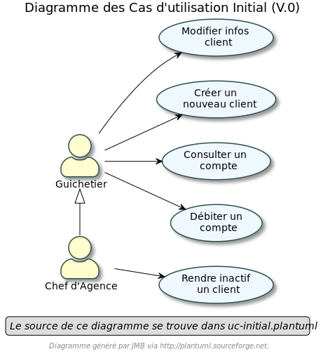
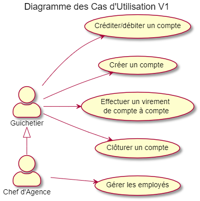

= Cahier des Charges Version 1

# 1. Sujet

La banque DailyBank souhaite développer une application JAVA-Oracle de gestion des comptes clients pour remplacer plusieurs outils obsolètes. Ce développement s’inscrit dans le cadre de la restructuration de ses services bancaires et l’application sera déployée dans les 100 agences que compte son réseau. Vous travaillerez à partir d’une application existante « Daily Bank » qu’il faudra adapter aux nouveaux besoins de la banque.

# 2. Analyse de l'existant

Actuellement l'application possède déjà un certain nombre de fonctionnalités.

Dans la version existante un guichetier peut :

* Modifier informations client (adresse, téléphone, …)

* Créer un nouveau client

* Consulter un compte

* Débiter un compte (BD)

Dans la version existante  un chef d’agence peut :

* Rendre inactif un client

## Diagramme des UC
 

# 3. Objectifs

L’application doit permettre de gérer des comptes bancaires de dépôt pour des clients préalablement créés. Elle devra permettre de débiter, créditer un compte soit par virement c’est à dire un échange d’argent entre deux comptes distincts mais domiciliés dans le réseau bancaire, soit par une personne physique se présentant devant un guichet.

## Use Cases

Guichetier :

* Créditer/débiter un compte (java et BD avec procédure stockée)

* Créer un compte

* Effectuer un virement de compte à compte

* Clôturer un compte

Chef d’Agence :

* Gérer (faire le « CRUD ») les employés (guichetier et chef d’agence)

## Diagramme des UC

Contraintes techniques :

 * Depot sur un repo github
 * Utilisation du format asciidoc 
   

