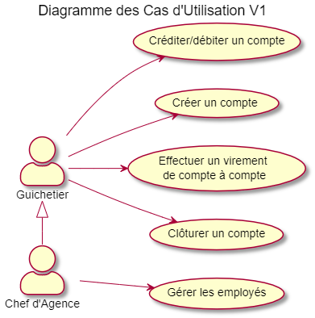
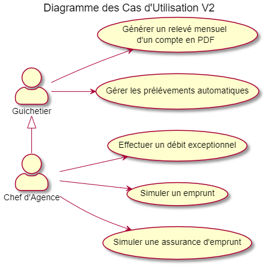

= Cahier des Charges Version 2
:toc:
:toc-title: Sommaire

# Équipe
* Nolan Jacquemont 
* James SANDALL ROBERTSON 
* Rémy GUIBERT

# 1. Contexte

La banque DailyBank souhaite développer une application JAVA-Oracle de gestion des comptes clients pour remplacer plusieurs outils obsolètes. Ce développement s’inscrit dans le cadre de la restructuration de ses services bancaires et l’application sera déployée dans les 100 agences que compte son réseau. Vous travaillerez à partir d’une application existante « Daily Bank » qu’il faudra adapter aux nouveaux besoins de la banque.

# 2. Analyse du client

Les utilisateurs de cette application seront les guichetiers et les chefs d'agences qui chacun doivent bénéficier d'accès et de fonctionnalités différentes.
Les guichetiers pourront créer de nouveaux clients et faire les opétations courantes.
Les chefs d'agences pourront gérer les employé set les opérations exeptionnelles. 

# 3. Objectifs

L’application doit permettre de gérer des comptes bancaires de dépôt pour des clients préalablement créés. Elle devra permettre de débiter, créditer un compte soit par virement c’est à dire un échange d’argent entre deux comptes distincts mais domiciliés dans le réseau bancaire, soit par une personne physique se présentant devant un guichet.

# 4. Analyse de l'existant

## Version 0
Actuellement l'application possède déjà un certain nombre de fonctionnalités.

### Use Cases
Dans la version existante un guichetier peut :

* Modifier informations client (adresse, téléphone, …)

* Créer un nouveau client

* Consulter un compte

* Débiter un compte (BD)

Dans la version existante un chef d’agence peut :

* Rendre inactif un client (Activer ou désactiver un compte)

### Diagramme des UC
 

# 5. Analyse des nouveaux besoins

## Version 1
### Use Cases

Guichetier :

* Créditer/débiter un compte (java et BD avec procédure stockée)

* Créer un compte

* Effectuer un virement de compte à compte

* Clôturer un compte

Chef d’Agence :

* Gérer (faire le « CRUD ») les employés (guichetier et chef d’agence)
Permettre de pouvoir créer, accéder, mettre à jour ou bien supprimer les employés de la banque

### Diagramme des UC

## Version 2
### Use Cases
Guichetier :

* Générer un relevé mensuel d’un compte en PDF
* Gérer les prélèvements automatiques

Chef d’Agence :

* Effectuer un Débit exceptionnel
* Simuler un emprunt
* Simuler une assurance d’emprunt

### Diagramme des UC

# 6. Contraintes

 * Respecter les contraintes juridiques (RGPD ...)
 * Utilisation et adaption d'une base de donnée existante
 * Utilisation du langage Java avec la librairie JavaFX
 * Création de plusieurs gantt pour "planifier" les tâches
 * Utilisation du format asciidoc 
   
# 7. Modalités d'organisation

* Afin de collaborer nous devons utiliser l'outil de "versioning" git.
* Gestion de la répartion des tâches à l'aide des "issues" proposés par github.

# 8. Livrables

* Gantt
* Cahier des charges
* Documentation technique
* Documentation Utilisateur
* Cahier de Recette
